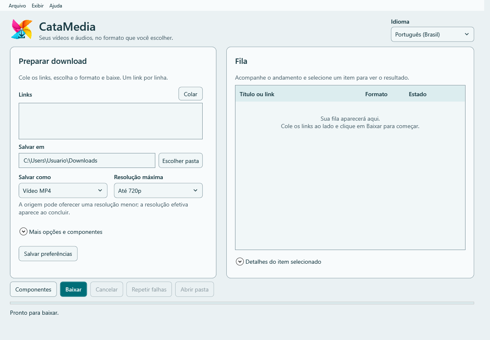
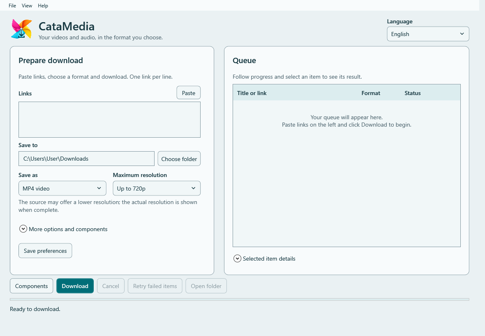

# CataMedia

**Vídeos e áudios, no formato que você escolher. / Your videos and audio, in the format you choose.**

[Guia PT-BR / English guide](WINDOWS_GUIDE.md) · [Início rápido / Quick start](TUTORIAL.md) · [Releases oficiais / Official releases](https://github.com/Wisleyv/media_download/releases) · [Suporte / Support](https://github.com/Wisleyv/media_download/issues)

## Português

O CataMedia C# 3.x é um aplicativo para Windows x64, com interface em português e inglês,
que usa yt-dlp para obter mídia autorizada. A versão estável **3.0.0** oferece instalador
e ZIP portátil na [release oficial](https://github.com/Wisleyv/media_download/releases/tag/v3.0.0).
A versão PowerShell 2.x permanece disponível nas releases anteriores.

- Vídeo MP4 com resolução máxima de 720p ou 1080p.
- Áudio MP3 com qualidade Baixa/Padrão/Alta; WAV e FLAC sem seletor de qualidade artificial.
- Fila sequencial, confirmação de playlists, cancelamento e repetição dos itens que falharam.
- Resultado e detalhes por item, com acesso à pasta do arquivo concluído.
- Obtenção e atualização assistidas de yt-dlp, FFmpeg/FFprobe e Node.js; progresso e validação antes da ativação.
- Consulta de novas versões estáveis C# 3.x, sem instalação automática e sem bloquear uso offline.
- Menus Arquivo, Exibir e Ajuda, opções avançadas e salvamento explícito de preferências.

### Escolha sua distribuição

| Opção | Como abrir | Dados do aplicativo |
|---|---|---|
| Instalador por usuário | Execute `CataMedia-Setup-<versão>-win-x64.exe`; abra pelo menu Iniciar | `%LOCALAPPDATA%\CataMedia\data` |
| ZIP portátil | Extraia **todo** `CataMedia-<versão>-win-x64-portable.zip`; abra `CataMedia.exe` | `data` ao lado do executável |

Ambos incluem o .NET e dispensam SDK ou ferramentas de desenvolvimento. Windows 11 x64
é o alvo principal; confira os requisitos e limites no [guia](WINDOWS_GUIDE.md).
Os pacotes **não incluem** yt-dlp, FFmpeg/FFprobe e Node.js. Na primeira execução,
abra **Componentes** e obtenha os três itens, um por vez, na mesma janela.
É possível selecionar ferramentas existentes em **Mais opções e componentes**.

O programa e o instalador não possuem assinatura digital. Confira origem e checksums.
Não há logs automáticos na pasta dos downloads. Preferências são salvas somente ao escolher
**Salvar preferências**. Use apenas conteúdo que tenha autorização para obter.

## English

CataMedia C# 3.x is a Windows x64 application with Portuguese and English interfaces,
using yt-dlp to obtain authorized media. Stable **3.0.0** provides an installer and a
portable ZIP in the [official release](https://github.com/Wisleyv/media_download/releases/tag/v3.0.0).
PowerShell 2.x remains available in earlier releases.

- MP4 video with a maximum resolution of 720p or 1080p.
- MP3 audio with Low/Standard/High quality; WAV and FLAC without an ineffective quality selector.
- Sequential queue, playlist confirmation, cancellation and retrying failed items.
- Per-item results and details, with access to the completed file's folder.
- Assisted acquisition and updates of yt-dlp, FFmpeg/FFprobe and Node.js, with progress and validation before activation.
- Stable C# 3.x version checks without automatic installation or blocking offline use.
- File, View and Help menus, advanced options and explicit preference saving.

Use the per-user installer and launch from Start, or extract the **entire** portable ZIP
and launch `CataMedia.exe`. Both bundle .NET; no SDK or development tools are required.
Windows 11 x64 is the primary target; see the [guide](WINDOWS_GUIDE.md) for requirements and limits.
External components are **not bundled**. Open **Components** and obtain each item in the
same window, or select existing tools in **More options and components**.

The application and installer are unsigned. Verify their official source and checksums.
Download logs are not created automatically. Choose **Save preferences** to persist settings.
Only obtain content you are authorized to download.

## Documentação / Documentation

- [Guia completo PT-BR/EN / Full guide](WINDOWS_GUIDE.md)
- [Início rápido PT-BR/EN / Quick start](TUTORIAL.md)
- [Início rápido em português](TUTORIAL_PT_BR.md)
- [Preparação e publicação de releases / Release procedure](RELEASING.md)
- [Licenças e componentes / Licenses and dependencies](WINDOWS_THIRD_PARTY.md)
- [Validação e limitações da etapa 6 / Stage 6 evidence and limits](WINDOWS_STAGE6.md)

As imagens mostram a compilação de desenvolvimento com caminhos e dados de exemplo.
Os PDFs/RTF antigos nesta pasta pertencem à documentação PowerShell; não são o manual C#.
Os fontes e manuais da versão anterior permanecem no [histórico v2.0.1](https://github.com/Wisleyv/media_download/tree/v2.0.1)
e na [release v2.0.1](https://github.com/Wisleyv/media_download/releases/tag/v2.0.1).

Images show a development build with example paths and data. Older PDF/RTF files in this
folder document PowerShell, not the C# application. Previous source, manuals and releases
remain available through the v2.0.1 links above.

## Autor e licença / Author and license

Wisley Vilela (WisleyVilela) · [GitHub](https://github.com/Wisleyv) · [MIT](../LICENSE).
