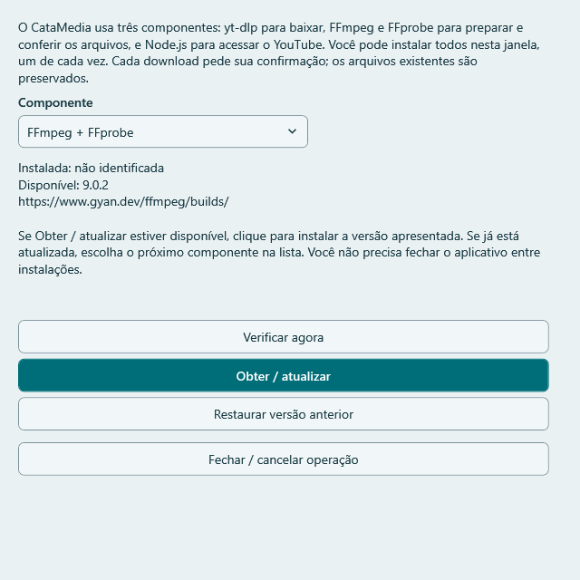
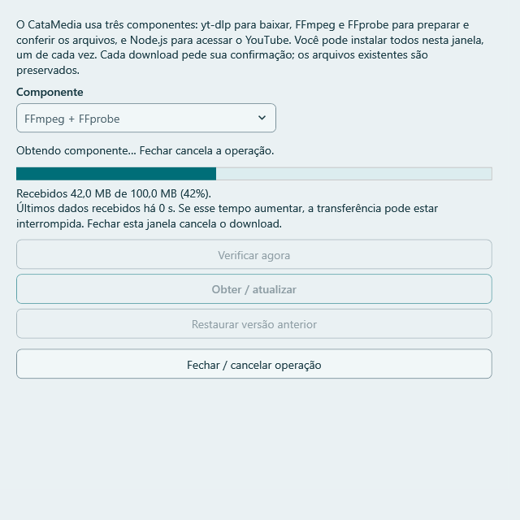
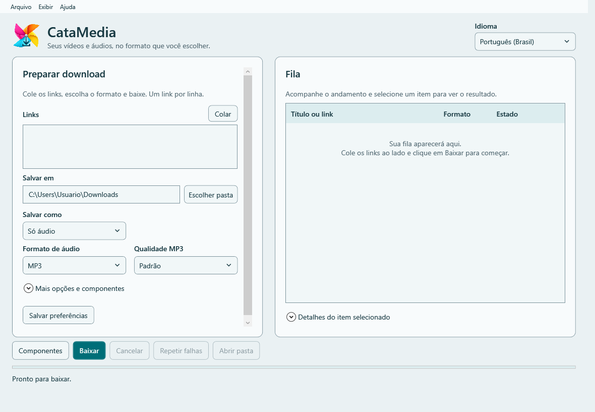
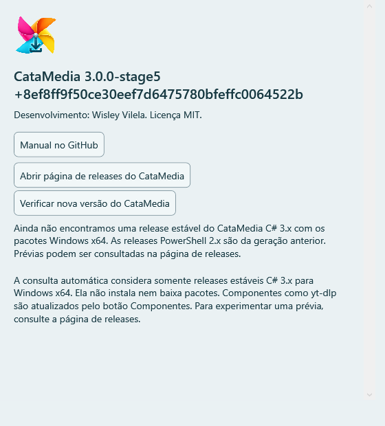
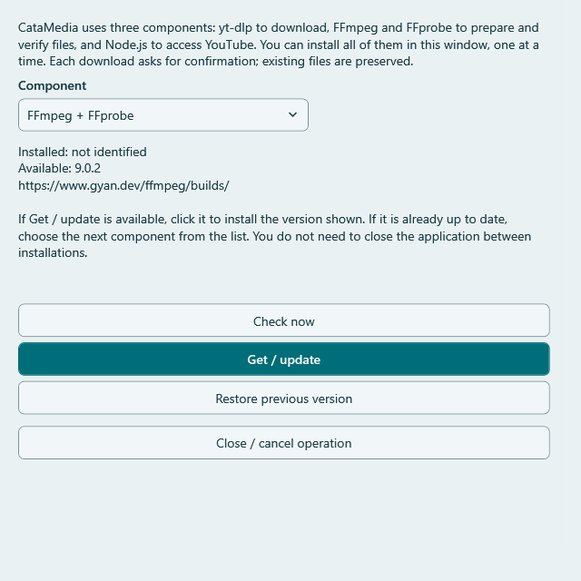
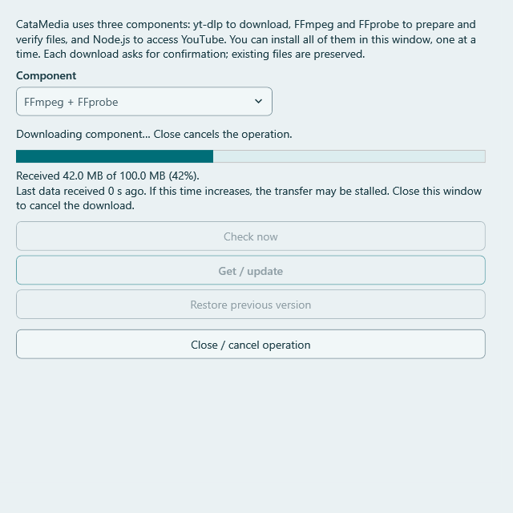
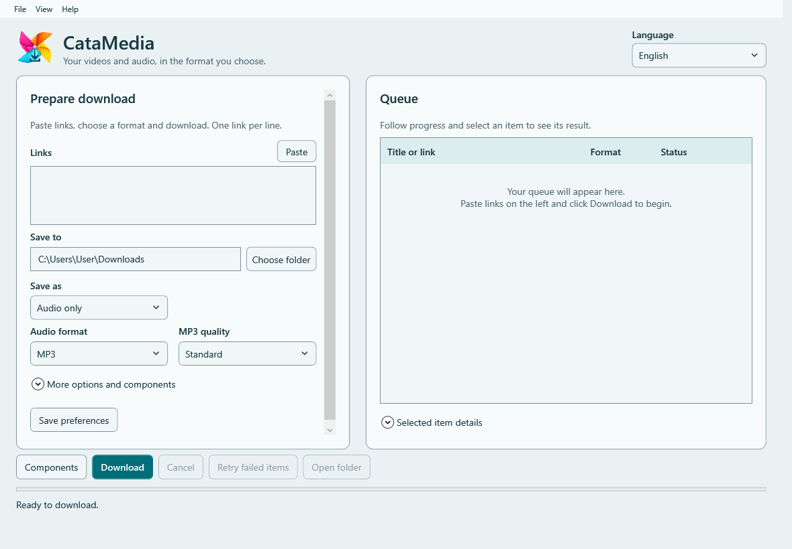
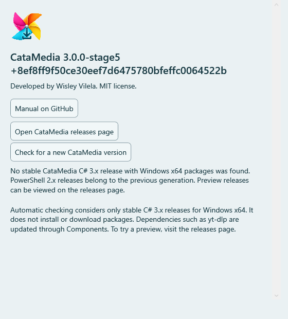

# CataMedia Windows — manual PT-BR / English user guide

Desenvolvimento / Developer: Wisley Vilela (WisleyVilela). Licença / License: MIT.
[Releases oficiais / Official releases](https://github.com/Wisleyv/media_download/releases) · [Suporte / Support](https://github.com/Wisleyv/media_download/issues)

Este manual é da linha **C# 3.x**, atualmente em preparação de distribuição. A versão
PowerShell 2.x permanece nas releases anteriores. As capturas mostram uma compilação de
desenvolvimento, caminhos de exemplo e, na barra de progresso, valores simulados.
O guia local `GUIDE.txt` contém as instruções textuais; as imagens estão no manual online.

This manual covers **C# 3.x**, currently being prepared for distribution. PowerShell 2.x
remains available in earlier releases. Screenshots show a development build, example paths
and simulated progress values. The offline `GUIDE.txt` contains text instructions;
images are available in the online manual.

## Português

### 1. Escolher e abrir o pacote

Na página oficial, escolha uma release **C# Windows 3.x** quando disponível. Uma prévia
estará identificada como *Pre-release*; ela não substitui automaticamente a versão estável.
Baixe o instalador **ou** o ZIP portátil e o arquivo `SHA256SUMS.txt` da mesma release.

| Opção | Arquivo | Como usar |
|---|---|---|
| Instalação por usuário | `CataMedia-Setup-<versão>-win-x64.exe` | Execute, escolha a pasta e abra pelo menu Iniciar. O atalho na área de trabalho é opcional. Não pede administrador. |
| Portátil | `CataMedia-<versão>-win-x64-portable.zip` | Extraia todo o ZIP em uma pasta gravável do usuário e abra `CataMedia.exe`. Não execute dentro do ZIP nem copie somente o EXE. |

O .NET está incluído: não instale SDK ou runtime separadamente. O foco de validação é
Windows 11 x64. O instalador aceita a partir do Windows 10 versão 2004/build 19041, mas esse
limite técnico não garante compatibilidade ou suporte em todas as edições. O suporte do
.NET depende da versão/edição do Windows; confira a [matriz Microsoft](https://learn.microsoft.com/en-us/dotnet/core/install/windows).
A validação ampla em Windows 10 permanece pendente. Android, ARM64 e 32 bits não são alvos desta distribuição.

Aplicativo e instalador **não possuem assinatura digital**. Confira origem e checksum:
`Get-FileHash -Algorithm SHA256 'caminho-do-arquivo'` no PowerShell e compare com a linha
correspondente de `SHA256SUMS.txt`. O hash confere integridade, não identifica o editor.
Em caso de bloqueio pelo Windows, confira a procedência e procure suporte; não desative
antivírus nem crie exceções gerais.

### 2. Preparar os componentes

Os pacotes não incluem **yt-dlp**, **FFmpeg/FFprobe** ou **Node.js**. Abra **Componentes**
na tela principal ou em **Ajuda → Componentes**.

1. Selecione **yt-dlp**. A janela consulta as versões automaticamente.
2. Confira versão e origem; clique em **Obter / atualizar** e confirme o download.
3. Aguarde a transferência, a validação e a mensagem de componente pronto.
4. Selecione **FFmpeg + FFprobe** e repita. Os dois são preparados e ativados juntos.
5. Selecione **Node.js 22 (YouTube)** e repita. Não é necessário sair da janela nem reiniciar o aplicativo entre os itens.

A barra mostra MB recebidos, volume total e percentual quando o servidor informa o tamanho.
Sem tamanho total, mostra atividade e MB recebidos. O tempo desde os últimos dados permite
perceber uma possível interrupção; **Fechar / cancelar operação** cancela a transferência.
Depois do download vem a validação: 100% recebido ainda não significa instalação concluída.

**Já possui as ferramentas?** Em **Mais opções e componentes**, selecione `yt-dlp.exe`,
a pasta com **ffmpeg.exe e ffprobe.exe juntos** e `node.exe` (22 ou superior). Não é necessário
copiá-los para a pasta do programa. A descoberta automática consulta a área de dependências,
a pasta do aplicativo e PATH; não procura em todo o computador nem modifica o PATH.
FFmpeg/FFprobe são exigidos também no fluxo de vídeo, para preparação e verificação.
Node.js dá suporte ao YouTube. Internet é necessária para obter componentes e mídia.

### 3. Escolher o resultado e baixar

1. Selecione o idioma no cabeçalho e cole um link por linha em **Links**; **Colar** usa a área de transferência.
2. Em **Salvar em**, escolha uma pasta existente e gravável.
3. Em **Salvar como**, escolha vídeo MP4 ou só áudio. Para vídeo, selecione resolução máxima de 720p ou 1080p. A origem pode fornecer uma resolução menor; o resultado informa a efetiva.
4. Para áudio, escolha MP3, WAV ou FLAC. MP3 oferece Baixa/Padrão/Alta; Padrão é a escolha recomendada. WAV e FLAC preservam o áudio recebido, mas não recuperam qualidade perdida na origem.
5. Clique em **Baixar**. Se aparecer confirmação de playlist, escolha a lista inteira ou somente o vídeo individual, quando essa opção estiver disponível.

A fila é sequencial. Estados como Preparando, Baixando e preparação do arquivo final indicam
as fases. Ao concluir, selecione o item para ver o caminho e use **Abrir pasta**.
**Cancelar** interrompe o trabalho e os itens seguintes; arquivos parciais podem permanecer
para retomada. **Repetir falhas** processa somente os itens que falharam.
Para entender uma falha, selecione o item e abra **Detalhes do item selecionado**.

### 4. Menus, preferências e opções avançadas

- **Arquivo:** escolher destino, salvar preferências e sair. Sair durante uma fila solicita cancelamento antes de fechar.
- **Exibir:** abrir/fechar os painéis de opções avançadas e detalhes.
- **Ajuda:** componentes e Ajuda/Sobre, com créditos, versão, guia local, manual online e releases.

Use **Salvar preferências**, na tela ou no menu Arquivo, para guardar idioma, destino e
opções de formato. Alterações não são salvas automaticamente. Caminhos de ferramentas
manuais precisam ser selecionados novamente em outra sessão; componentes gerenciados
são redescobertos na próxima abertura.

Cookies do navegador são opcionais e desativados por padrão. Só selecione um navegador
para conteúdo que tenha autorização para acessar; a leitura depende do yt-dlp e das
condições do navegador/site. O aplicativo não armazena seus cookies e não solicita senha.
Para usuários avançados: o motor ignora configurações externas do yt-dlp (`--ignore-config`)
e plugins externos; essas configurações não substituem as escolhas feitas na interface.

### 5. Atualizar sem perder dados

**CataMedia:** consulta novas versões em segundo plano ao abrir. Em **Ajuda/Sobre**, use
**Verificar nova versão do CataMedia** para repetir. São consideradas apenas releases
estáveis C# 3.x com instalador, ZIP Windows x64 e checksums. PowerShell 2.x e prévias não
são oferecidas automaticamente; prévias podem ser consultadas pela página de releases.
Um aviso oferece acesso à release ou **Mais tarde**. Nenhum pacote é baixado ou instalado
automaticamente. Falhar na consulta não bloqueia o aplicativo; baixar mídia ainda exige rede.

No instalado, feche o aplicativo e execute o novo instalador sobre a mesma pasta.
No portátil, feche, faça cópia de segurança de `data` e extraia o novo ZIP sobre os arquivos
do programa, preservando `data`. Não misture os marcadores de instalação e portabilidade.

**Componentes:** atualizados separadamente por **Componentes**, com confirmação e validação.
Não são substituídos durante uma fila. **Restaurar versão anterior** recupera versões
obtidas pelo CataMedia; não restaura ferramentas escolhidas manualmente. Versões antigas
não são apagadas automaticamente. Atualizar yt-dlp pode ajudar após mudanças nos sites,
mas não garante acesso a conteúdo privado ou restrito.

### 6. Dados, desinstalação e problemas

| Conteúdo | Portátil | Instalado |
|---|---|---|
| Preferências e componentes | `data` ao lado de `CataMedia.exe` | `%LOCALAPPDATA%\CataMedia\data` |
| Mídia | Pasta escolhida em Salvar em | Pasta escolhida em Salvar em |
| Guia offline | `GUIDE.txt` no pacote completo | `GUIDE.txt` na pasta do programa |

Não há logs automáticos por download. Mensagens e detalhes ficam na sessão; revise
informações privadas antes de compartilhá-las. A desinstalação remove programa e atalhos,
mas preserva dados e mídia. Remover seus dados depois é uma ação manual separada;
nunca apague a pasta de mídia para desinstalar o programa.

| Situação | O que fazer |
|---|---|
| Componentes ausentes | Obtenha cada item em Componentes ou selecione arquivos existentes nas opções avançadas. |
| Versão FFmpeg não identificada | Pode ser uma compilação de desenvolvimento. O arquivo foi preservado; a comparação não é possível. A versão oferecida será instalada separadamente se você confirmar. |
| Progresso sem novos dados | Confira conexão e espaço; cancele/feche se necessário e tente novamente. A versão ativa gerenciada é preservada em falhas. |
| Pasta portátil protegida | Extraia todo o ZIP em outra pasta gravável do usuário. |
| Preferências corrompidas | O arquivo é preservado e o salvamento bloqueado. Faça uma cópia e procure suporte. |
| Link privado, removido ou restrito | Consulte os detalhes; confirme seu acesso e a validade do link. Atualizar não supera restrições de acesso. |
| Arquivo final não aparece | Selecione um item concluído e use Abrir pasta; confira o caminho exibido e o destino escolhido. |

O piloto validou o portátil, a obtenção de componentes, o progresso e as correções visuais.
Ainda estão pendentes instalador em máquina limpa, conta padrão separada, atualização entre
versões diferentes e validação completa de teclado/leitor de tela/DPI real. Consulte
[registro da etapa 6](WINDOWS_STAGE6.md) antes de interpretar esta prévia como release final.

## English

### 1. Choose and open a package

On the official releases page, choose a **C# Windows 3.x** release when available.
A preview is marked *Pre-release*; it does not automatically replace the stable version.
Download either the installer or portable ZIP, plus `SHA256SUMS.txt` from the same release.

| Option | File | How to use |
|---|---|---|
| Per-user installation | `CataMedia-Setup-<version>-win-x64.exe` | Run it, choose the folder and launch from Start. The desktop shortcut is optional. Administrator privileges are not requested. |
| Portable | `CataMedia-<version>-win-x64-portable.zip` | Extract the entire ZIP into a writable user folder and open `CataMedia.exe`. Do not run inside the ZIP or copy only the EXE. |

.NET is bundled; do not install an SDK or runtime separately. Windows 11 x64 is the primary
validation target. The installer accepts Windows 10 version 2004/build 19041 or newer,
but that technical minimum does not guarantee compatibility or support for every edition.
.NET support depends on the Windows version/edition; see the [Microsoft matrix](https://learn.microsoft.com/en-us/dotnet/core/install/windows).
Broad Windows 10 validation is pending. Android, ARM64 and 32-bit are outside this distribution.

The application and installer are **unsigned**. Verify their source and checksum:
run `Get-FileHash -Algorithm SHA256 'file-path'` in PowerShell and compare the matching
entry in `SHA256SUMS.txt`. Hashes check integrity, not publisher identity. If Windows blocks
execution, verify the source and seek support; do not disable antivirus or add broad exclusions.

### 2. Prepare components

Packages do not include **yt-dlp**, **FFmpeg/FFprobe** or **Node.js**. Open **Components**
from the main window or **Help → Components**.

1. Select **yt-dlp**. Versions are checked automatically.
2. Review the version and source; click **Get / update** and confirm the download.
3. Wait for transfer, validation and the ready message.
4. Select **FFmpeg + FFprobe** and repeat. Both are prepared and activated together.
5. Select **Node.js 22 (YouTube)** and repeat. Stay in the same window; no restart is required between items.

When the server supplies a size, progress shows received MB, total and percentage.
Otherwise it shows activity and received MB. Time since the last data helps reveal a
possible interruption; **Close / cancel operation** cancels transfer. Validation follows
download: 100% received does not yet mean installation is complete.

**Already have the tools?** In **More options and components**, select `yt-dlp.exe`, a
folder containing **both ffmpeg.exe and ffprobe.exe**, and `node.exe` (22 or newer).
No copying into the application folder is needed. Automatic discovery checks dependency
storage, the application folder and PATH; it neither searches the whole computer nor
modifies PATH. FFmpeg/FFprobe are required for video preparation/verification too.
Node.js supports YouTube. Acquiring components and media requires internet access.

### 3. Choose output and download

1. Select the language in the header and paste one link per line in **Links**; **Paste** uses the clipboard.
2. In **Save to**, choose an existing writable folder.
3. In **Save as**, choose MP4 video or audio only. For video, select a maximum of 720p or 1080p. The source may offer less; the result shows the actual resolution.
4. For audio, select MP3, WAV or FLAC. MP3 offers Low/Standard/High; Standard is recommended. WAV and FLAC preserve received audio, but cannot restore quality lost at the source.
5. Click **Download**. If asked about a playlist, choose the entire list or the individual video when available.

The queue runs sequentially. Preparing, Downloading and final-file processing indicate
its phases. After completion, select the item to see the path and use **Open folder**.
**Cancel** interrupts the work and following items; partial files may remain for resuming.
**Retry failed items** processes only failures. Select a failed item and expand
**Selected item details** to understand what happened.

### 4. Menus, preferences and advanced options

- **File:** choose the destination, save preferences and exit. Exiting during a queue cancels before closing.
- **View:** expand/collapse the advanced options and details panels.
- **Help:** components and Help/About, including credits, version, local guide, online manual and releases.

Choose **Save preferences**, on the main window or File menu, to retain language,
destination and format choices. Changes are not saved automatically. Manually selected
tool paths must be selected again in another session; managed components are rediscovered.

Browser cookies are optional and off by default. Select a browser only for content you
are authorized to access; extraction depends on yt-dlp and the browser/site conditions.
CataMedia does not store cookies or request passwords. For advanced users: the engine
ignores external yt-dlp configuration (`--ignore-config`) and external plugins; those
settings do not override the interface choices.

### 5. Update while preserving data

**CataMedia:** checks in the background at startup. Use **Check for a new CataMedia version**
in **Help/About** to check again. Only stable C# 3.x releases with Windows x64 installer,
portable ZIP and checksums are considered. PowerShell 2.x and previews are not offered
automatically; previews remain accessible through the releases page. A notice offers the
release or **Later**. No package is downloaded or installed automatically. A failed check
does not block the application; acquiring media still requires network access.

Close the installed application and run the new installer in the same folder. For portable
updates, close it, back up `data` and extract the new ZIP over program files, preserving
`data`. Do not mix installed/portable markers.

**Components:** updated separately through **Components**, with consent and validation.
They are not replaced during a queue. **Restore previous version** recovers versions
obtained by CataMedia, not manually selected tools. Old versions are not deleted automatically.
Updating yt-dlp may help after site changes, but does not guarantee access to private/restricted media.

### 6. Data, uninstalling and troubleshooting

| Content | Portable | Installed |
|---|---|---|
| Preferences and components | `data` beside `CataMedia.exe` | `%LOCALAPPDATA%\CataMedia\data` |
| Media | Folder selected in Save to | Folder selected in Save to |
| Offline guide | `GUIDE.txt` in the complete package | `GUIDE.txt` in the application folder |

No automatic per-download logs are created. Messages and details stay in the session;
check for private information before sharing. Uninstall removes the program and shortcuts,
but preserves data and media. Removing personal data later is a separate manual action;
never delete the media folder to uninstall CataMedia.

| Situation | Action |
|---|---|
| Missing components | Obtain each through Components or select existing tools in advanced options. |
| Unidentified FFmpeg version | It may be a development build. The file is preserved and cannot be compared. An offered version is installed separately if confirmed. |
| No new progress data | Check network and space; cancel/close if needed and retry. Failed operations preserve the managed active version. |
| Protected portable folder | Extract the entire ZIP into another writable user folder. |
| Corrupt preferences | The file is preserved and saving blocked. Back it up and seek support. |
| Private, removed or restricted link | Review details and check your access/link validity. Updates do not bypass access restrictions. |
| Final file cannot be found | Select a completed item and use Open folder; check the displayed path and chosen destination. |

The pilot validated portable use, component acquisition, progress and visual fixes.
Clean-machine installer, a separate standard-user account, upgrades between different
versions and full keyboard/screen-reader/real-DPI validation remain pending. See the
[stage 6 record](WINDOWS_STAGE6.md) before treating this preview as a final release.
